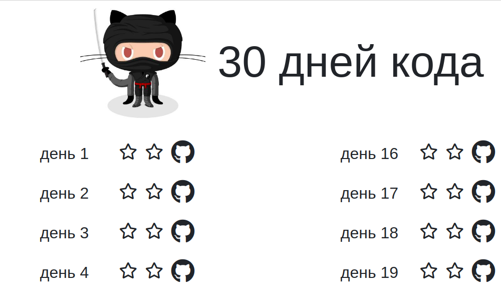

# 30 Дней кода

Скрипт для генерации чеклиста — отмечайте в нём каждый свой коммит, следите за прогрессом.

## Как установить

Установите Python пакеты из `requirements.txt`:

```
$ pip install -r requirements.txt
```

Запустите скрипт:

```
$ python script.py
```

Скрипт создаст в каталоге новый файл `index.html`, откройте его в браузере:



Вы можете распечатать эту страницу на принтере и повесить лист на холодильник. Отмечайте каждый свой коммит, следите за прогрессом.
